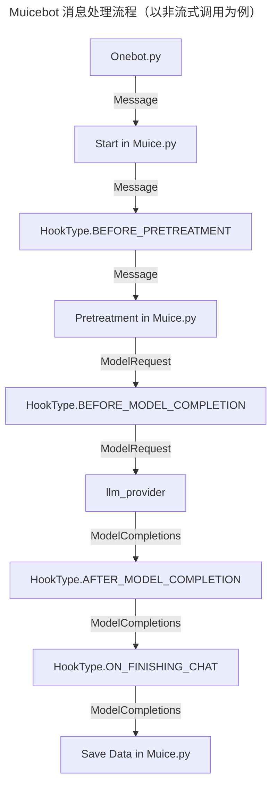

# API 参考

## 插件加载方式

> `nonebot.load_plugin()` 还是 `muicebot.plugin.load_plugin()` ?

在 Muicebot 中，插件分为两类，一类分为 Nonebot 插件，另一类是 Muicebot 插件。

其中 Nonebot 插件的安装方式是通过 `nb plugin install` ，然后读取 `pyproject.toml` 中的插件条目进行加载

Muicebot 插件则是统一存放在 `plugins` 或者是 `plugins/store` 文件夹下，通过 `muicebot.plugin.load_plugins()` 函数统一加载

乍一看好像这两类插件都能被成功加载进 Muicebot 中，但是如果我们与一些数据存储插件一同使用的话，就会发生冲突，比如 `nonebot_plugin_orm` 插件

如果 Muicebot 中的某个插件依赖于 `nonebot_plugin_orm` 或者是 `nonebot_plugin_localstore` 进行数据存储，并且通过 `muicebot.plugin.load_plugin()` 进行加载，那么这些数据存储插件就会把 `muicebot` 的数据目录/数据库划分给这个插件（因为 Muicebot 本身被视为该插件的父插件），从而造成数据目录/数据库冲突。

解决这个问题的最好方式是将这个插件作为 Nonebot 插件发布并通过 Nonebot 方式加载，当然你也可以通过 Muicebot 自身的接口来获取到数据目录从而避免冲突。

在下文中，我们将首先介绍 Muicebot 的数据接口，然后再介绍 Muicebot 插件开发者所有你可能会使用到的类和接口以方便你开发插件。

## 获取数据目录

目前，Muicebot 仅提供了获取数据目录的接口，如需获取数据库会话，建议使用 `nonebot_plugin_orm` 然后将成品插件作为 Nonebot 插件发布

获取数据目录方法：

```python
from muicebot.plugin import get_plugin_data_dir

data_dir = get_plugin_data_dir()
```

该函数文档说明如下：

```python
def get_plugin_data_dir() -> Path:
    """
    获取 Muicebot 插件数据目录

    对于 Muicebot 的插件，它们的插件目录位于 Muicebot 的插件目录中下的 `plugins` 文件夹，并以插件名命名
    (`nonebot_plugin_localstore.get_plugin_data_dir`)
    """
```

这个方法将返回只属于该插件名的一个目录，这个目录位于 `nonebot_plugin_localstore.get_plugin_data_dir() / "plugin" / plugin_name`

这个文件夹是默认创建的。如果出于未知的情况无法获取插件名，则会使用 `.unknown` 命名该文件夹

如果出现 `.unknown` 的情况，还请及时向我们反馈！


## 插件信息

像 Nonebot 一样，在 Muicebot 中每个插件都有自己的一个 `Plugin` 对象，这其中存储了插件系统所需要的一系列信息，其中就包括插件元数据 `PluginMetadata`，它允许插件开发者为插件添加一些额外的信息。这些信息编写于插件模块的顶层，可以直接通过源码查看。

在插件顶层模块 `__init__.py` 中添加插件元数据，如下所示：

```
from muicebot.plugin import PluginMetadata

from .config import Config

__plugin_meta__ = PluginMetadata(
    name="示例插件",
    description="这是一个示例插件",
    usage="没什么用",
    homepage="https://example.com/",
    config=Config,
    extra={},
)
```

> [!IMPORTANT]
>
> 对于要发布在 Muicebot-Plugin-Index 的插件来说，插件元数据是必须的，没有插件元数据将无法通过工作流测试

## Muicebot 消息处理概述



---

# API 参考

以下列出了 Muicebot 中常见的 API 接口和类以供插件开发者们使用

## muicebot.muice

本模块负责主消息处理流程

### class Muice

Muice 交互类（主消息处理流程），以单例模式提供

可以通过 `Muice()` 或者是 `Muice.get_instance()` 方法获得以供 Muice 实例

#### def ask(self, session: async_scoped_session, message: Message,enable_history: bool = True, enable_plugins: bool = True,)

- **说明**
    调用模型（完整的消息处理流程）

- **参数**
    - `session:async_scoped_session` 数据库会话
    - `message:Message` 消息主体
    - `enable_history:bool` 是否启用历史记录
    - `enable_plugins:bool` 是否启用工具插件

- **返回**
    - `ModelCompletions` 模型回复

#### def ask_stream(self, session: async_scoped_session, message: Message,enable_history: bool = True, enable_plugins: bool = True,)

- **说明**
    流式调用模型（完整的消息处理流程）

- **参数**
    - `session:async_scoped_session` 数据库会话
    - `message:Message` 消息主体
    - `enable_history:bool` 是否启用历史记录
    - `enable_plugins:bool` 是否启用工具插件

- **返回**
    - `AsyncGenerator[ModelStreamCompletions, None]` 模型回复


#### def refresh(self, userid: str, session: async_scoped_session,)

- **说明**
    刷新对话

- **参数**
    - `session:async_scoped_session` 数据库会话
    - `userid:str` 用户ID

- **返回**
    - `Union[AsyncGenerator[ModelStreamCompletions, None], ModelCompletions]`


## muicebot.models

本模块定义了 Muicebot 消息处理流程中的数据类

### class Resource

多模态消息

#### class-var type

- **类型**

    Literal["image", "video", "audio", "file"]

- **说明**

    消息类型

#### class-var path

- **类型**

    str

- **说明**

    本地存储地址(对于模型处理是必需的)

#### class-var url

- **类型**

    Optional[str]

- **说明**

    远程存储地址(一般不传入模型处理中)

#### class-var raw

- **类型**

    Optional[Union[bytes, BytesIO]]

- **说明**

    二进制数据（只使用于模型返回且不保存到数据库中）

#### class-var mimetype

- **类型**

    Optional[str]

- **说明**

    文件元数据类型

#### def ensure_mimetype(self)

- **说明**

    确保文件元数据类型存在，否则就获取

#### def to_dict(self)

- **说明**

    落库时存储的数据
    (注意：与模型进行交互的多模态文件必须在本地拥有备份)

- **返回类型**

    dict

<details>
<summary>具体代码实现</summary>

```python
def to_dict(self) -> dict:
"""
落库时存储的数据
(注意：与模型进行交互的多模态文件必须在本地拥有备份)
"""
return {"type": self.type, "path": self.path, "mimetype": self.mimetype}
```
</details>

### class Message

#### class-var id

- **类型**

    Optional[int]

- **说明**

    每条消息的唯一ID

#### class-var time

- **类型**

    str

- **说明**

    字符串形式的时间数据：%Y.%m.%d %H:%M:%S
    若要获取格式化的 datetime 对象，请使用 format_time

- **默认值**

    `datetime.strftime(datetime.now(), "%Y.%m.%d %H:%M:%S")`

#### class-var userid

- **类型**

    str

- **说明**

    Nonebot 的用户id

#### class-var groupid

- **类型**

   str

- **说明**

    群组id，私聊设为-1

- **默认值**

    "-1"

#### class-var message

- **类型**

    str

- **说明**

    消息主体

#### class-var respond

- **类型**

    str

- **说明**

    模型回复（不包含思维过程）

#### class-var history

- **类型**

    int

- **说明**

    消息是否可用于对话历史中，以整数形式映射布尔值

#### class-var resources

- **类型**

    List[[Resource](#class-resource)] 

- **说明**

    多模态消息内容

#### class-var usage

- **类型**

    int

- **说明**

    使用的总 tokens, 若模型加载器不支持则设为 -1

- **默认值**

    -1

#### class-var profile

- **类型**

    str

- **说明**

    消息所属存档

- **默认值**

    "_default"


#### property format_time

- **类型**

    str

- **说明**

    时间字符串转换为 datetime 对象

#### def to_dict(self)

- **返回类型**

    dict

#### def from_dict(data: dict)

- **返回类型**

    [Message](#class-message)

## muicebot.llm

本模块定义了 LLM 定义及其 Provider 实现

### abstract class BaseLLM(model_config: ModelConfig)

#### class-var config

- **类型**

    [ModelConfig](#class-modelconfig)

- **说明**

    模型配置

#### class-var is_runing

- **类型**

    bool

- **说明**

    模型状态

- **默认值**

    False

#### class-var _total_tokens

- **类型**

    int

- **说明**

    本次总请求（包括工具调用）使用的总token数。当此值设为-1时，表明此模型加载器不支持该功能

- **默认值**

    -1

#### def _require(self, *require_fields: str)

- **说明**

    通用校验方法：检查指定的配置项是否存在，不存在则抛出错误

- **参数**

    - `*require_fields:str` 需要检查的字段名称（字符串）

#### def _build_messages(self, request: ModelRequest)

- **说明**

    构建 SDK 专用历史上下文的函数

- **返回类型**

    list

#### def load(self)

- **说明**

    加载模型（通常是耗时操作，在线模型如无需校验可直接返回 true）

- **返回**

    bool 是否加载成功

### abstractmethod def ask(self, request: ModelRequest, *, stream: bool = False):

- **说明**

    模型交互询问

- **参数**

    [ModelRequest](#class-modelrequest) request 模型调用请求体
    bool stream 是否开启流式对话

- **返回**

    Union[[ModelCompletions](#class-modelcompletions), AsyncGenerator[[ModelStreamCompletions](#class-modelstreamcompletions), None]] 模型输出体

### class ModelConfig(BaseModel)

模型通用配置

参见: [_config.py](https://github.com/Moemu/MuiceBot/blob/main/muicebot/llm/_config.py#L7)


### class ModelRequest:

模型调用请求

#### class-var prompt

- **类型**

    str

#### class-var history

- **类型**

    List[[Message](#class-message)]

- **默认值**

    []

#### class-var resources

- **类型**

    List[[Resource](#class-resource)]

- **默认值**

    []

#### class-var tools

- **类型**

    Optional[List[dict]]

- **默认值**

    []

#### class-var system

- **类型**

    Optional[str]

- **默认值**

    None

### class ModelCompletions

模型输出

#### class-var text

- **类型**

    str

#### class-var usage

- **类型**

    int

- **默认值**

    -1

#### class-var resources

- **类型**

    List[[Resource](#class-resource)]

- **默认值**

    []

#### class-var succeed

- **类型**

    Optional[bool]

- **默认值**

    true

### class ModelStreamCompletions

模型流式输出

#### class-var chunk

- **类型**

    str

#### class-var usage

- **类型**

    int

- **默认值**

    -1

#### class-var resources

- **类型**

    List[[Resource](#class-resource)]

- **默认值**

    []

#### class-var succeed

- **类型**

    Optional[bool]

- **默认值**

    true