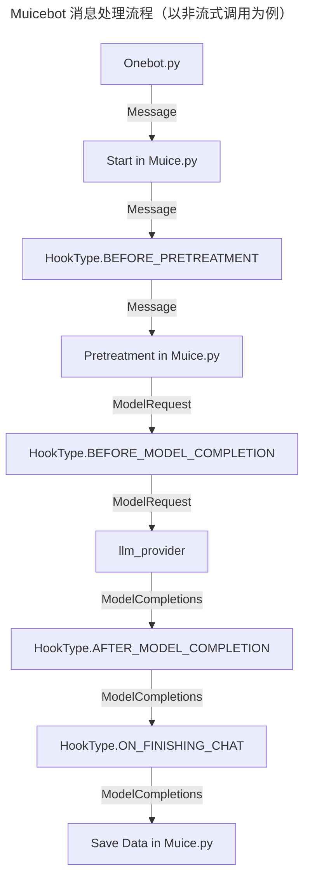

# 优秀实践

## 插件加载方式

> `nonebot.load_plugin()` 还是 `muicebot.plugin.load_plugin()` ?

在 Muicebot 中，插件分为两类，一类分为 Nonebot 插件，另一类是 Muicebot 插件。

其中 Nonebot 插件的安装方式是通过 `nb plugin install` ，然后读取 `pyproject.toml` 中的插件条目进行加载

Muicebot 插件则是统一存放在 `plugins` 或者是 `plugins/store` 文件夹下，通过 `muicebot.plugin.load_plugins()` 函数统一加载

在 v1.0.1 之后的版本，这两种方式没有本质上的区别，因为 `muicebot.plugin.load_plugins()` 最后会使用 `nonebot.load_plugin()` 进行插件的加载

也就是说，Muicebot 的插件实际上就是**Nonebot 插件**，只不过不能在其他 Nonebot 项目中使用而已

在下文中，我们将首先介绍 Muicebot 的数据接口，然后再介绍 Muicebot 插件开发者所有你可能会使用到的类和接口以方便你开发插件。

## 存储数据

目前，Muicebot 仅提供了获取数据目录的接口，如需获取数据库会话，建议使用 `nonebot_plugin_orm` 进行数据库操作

### 获取数据目录(muicebot内置方法)

获取数据目录方法：

```python
from muicebot.plugin import get_plugin_data_dir

data_dir = get_plugin_data_dir()
```

该函数文档说明如下：

```python
def get_plugin_data_dir() -> Path:
    """
    获取 Muicebot 插件数据目录

    对于 Muicebot 的插件，它们的插件目录位于 Muicebot 的插件目录中下的 `plugins` 文件夹，并以插件名命名
    (`nonebot_plugin_localstore.get_plugin_data_dir`)
    """
```

这个方法将返回只属于该插件名的一个目录，这个目录位于 `nonebot_plugin_localstore.get_plugin_data_dir() / "plugin" / plugin_name`

这个文件夹是默认创建的。如果出于未知的情况无法获取插件名，则会使用 `.unknown` 命名该文件夹

如果出现 `.unknown` 的情况，还请及时向我们反馈！

### 获取数据目录(nonebot_plugin_localstore方法)

获取数据目录方法：

```python
from nonebot_plugin_localstore import get_plugin_data_dir

data_dir = get_plugin_data_dir()
```

### 获取数据库会话(nonebot_plugin_orm)

_参见[开发者指南](https://nonebot.dev/docs/best-practice/database/developer/)_

## 插件信息

像 Nonebot 一样，在 Muicebot 中每个插件都有自己的一个 `Plugin` 对象，这其中存储了插件系统所需要的一系列信息，其中就包括插件元数据 `PluginMetadata`，它允许插件开发者为插件添加一些额外的信息。这些信息编写于插件模块的顶层，可以直接通过源码查看。

在插件顶层模块 `__init__.py` 中添加插件元数据，如下所示：

```python
from muicebot.plugin import PluginMetadata

from .config import Config

__plugin_meta__ = PluginMetadata(
    name="示例插件",
    description="这是一个示例插件",
    usage="没什么用",
    homepage="https://example.com/",
    config=Config,
    extra={},
)
```

> [!TIP]
>
> 对于要发布在 Muicebot-Plugin-Index 的插件来说，插件元数据是必须的，没有插件元数据将无法通过工作流测试

## Muicebot 消息处理概述



## 模型交互

### 获取全局模型实例

```python
from muicebot.muice import Muice

model = Muice.get_instance().model
```

这将获取全局对话中的模型实例

### 通过模型配置文件初始化实例

```python
from muicebot.llm import load_model
from muicebot.config import get_model_config

multimodal_model = load_model(get_model_config(config.meme_multimodal_config))
multimodal_model.load()  # 加载模型
```

### 与模型交互

```python
from muicebot.llm import ModelCompletions, ModelRequest
from muicebot.model import Resource

# 确保是多模态模型
if not (model and model.is_running):
    raise RuntimeError("LLM 尚未运行！")
elif not model.config.multimodal:
    raise RuntimeError("LLM 不是多模态的！")

# 构建多模态资源
image = Resource("image", path="./Muika_cos.png")

# 构建模型请求，并传入系统提示词和 Resource 多模态资源
model_request = ModelRequest(prompt, system=system, resources=[image])
# 初始化模型用量, -1 表示该模型加载器不支持模型用量查询
response_usage = -1
logger.debug(f"向 LLM 发送请求: {model_request}")

# 与LLM交互
response = await model.ask(model_request, stream=model.config.stream)

# 如果是非流式调用
if isinstance(response, ModelCompletions):
    response_text = response.text
    response_usage = response.usage
    response_status = response.succeed
# 如果是流式调用
else:
    response_chunks: list[str] = []
    response_usage = -1
    response_status = True
    async for chunk in response:
        response_chunks.append(chunk.chunk)
        response_usage = chunk.usage if chunk.usage > response_usage else response_usage
        response_status = chunk.succeed if not chunk.succeed else response_status
    # 拼接流式响应
    response_text = "".join(response_chunks)

# 断言是否请求成功
assert response_status, "LLM请求失败"

logger.debug(f"LLM 请求已完成，用量: {response_usage}")
```

### 提取思考结果

模型交互层不会自动提取思考结果，也无法从配置文件中推断目前选用的是否是推理模型，因此无论是否启用了推理模式，你都需要手动处理模型输出后的结果

```python
import re

def process_message(message: str) -> str:
    """
    提取思考结果
    """
    if not message.startswith("<think>"):
        return message

    thoughts_pattern = re.compile(r"<think>(.*?)</think>", re.DOTALL)
    result = thoughts_pattern.sub("", message).strip()

    return result
```

### 获取文本嵌入信息

```python
from muicebot.config import get_embedding_model_config
from muicebot.llm import load_embedding_model
from async_lru import alru_cache

# 请注意，由于 `embedding_model_config` 对于用户而言是可选的
# 当配置文件不存在/为空时，会抛出 `FileNotFoundError`
embedding_model = load_embedding_model(get_embedding_model_config())

@alru_cache(maxsize=1024)
async def _get_embedding(self, text: str) -> ndarray:
    """
    调用 OpenAI API 兼容端口获取字符串的嵌入向量，支持离线缓存

    :param text: 要查询的字符串
    """
    logger.debug(f"正在查询文本嵌入向量: {text[:50]}...")

    # 缓存未命中，调用 API
    start_time = perf_counter()
    try:
        response = await embedding_model.embed([text])
        embedding = np.array(response.embeddings[0])

        end_time = perf_counter()
        logger.debug(f"已完成查询，用时: {end_time - start_time}s")
        return embedding

    except Exception as e:
        logger.error(f"获取嵌入向量失败: {e}")
        raise
```